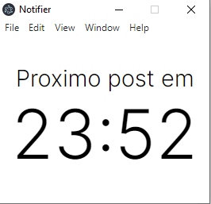
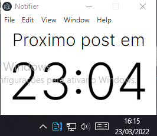

## Notifier
  
  

### 💻 Projeto

Com a intençao de criar um app para ajudar nos estudos, resolvi criar um projeto utilizando o electron junto a tecnica pomodoro.

### 🛠 Tecnologias

https://www.electronjs.org/pt/docs/latest/tutorial/quick-start

  
  
  

### ✍🏾 Autor

<a  href="https://github.com/gabrielmedrados/">

  
Gabriel Medrado

</a>
